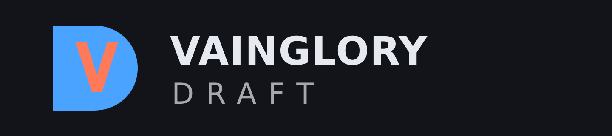

# VainGloryDraft



A tool for running custom pick/ban drafts for Vainglory, aimed at tournament
organisers and their captains. 5v5 and 3v3 run on the same engine.

The design is in [docs/HANDOFF.md](docs/HANDOFF.md). What is built: a pure draft
engine, a Cloudflare Durable Object holding one room each with an authoritative
clock, and a React client. You can create a room, hand out three links, and run
a draft end to end.

## The one idea

A draft is a single ordered list of turns. Bans and picks are not two systems:

```ts
const script = parseScript("Aban, Bban, Apick, Bpick x2, Apick x2, Bpick");
```

5v5, 3v3 and any custom order are different arrays, nothing else. Everything the
engine reports — expected picks per team, minimum pool size, whose turn it is —
is *derived* from the script. Nothing assumes "five picks a side".

## What is here

| Module | Responsibility |
|---|---|
| `src/types.ts` | `Team`, `Action`, `Turn`, `TurnScript`, `Hero`, `DraftConfig`, `DraftState` |
| `src/script.ts` | Script validation, derived totals, `parseScript`/`formatScript` notation |
| `src/config.ts` | Room defaults: mirror picks off, auto-fill random |
| `src/engine.ts` | The engine: current turn, legal heroes, staging, commit, timeout resolution |
| `src/record.ts` | The account of a finished draft, derived from its turns |
| `src/timer.ts` | Per-turn clock plus reserve bank. Pure: computes, never counts down |
| `src/events.ts` | `pick \| ban \| turnChange \| draftComplete` and a subscription bus |
| `src/projection.ts` | Per-token filtered views of the room |
| `src/presets.ts` | Named scripts, including the default `vg-5v5-standard` |
| `src/heroes.ts`, `data/heroes.json` | Static roster, checked in, never fetched at runtime |
| `src/room/` | Room: engine + clock + tokens + connections. No Cloudflare imports |
| `src/room/roster.ts` | Who is on each side, who leads, and who has said they are ready |
| `src/room/suggestions.ts` | What a side has asked its own captain for |
| `src/room/names.ts` | The name a player is offered before they type one |
| `worker/` | Durable Object and Worker routes — a thin adapter over `Room` |
| `worker/gatekeeper.ts` | One per address, so an open site cannot be scripted at |
| `client/` | React + Vite SPA: the create screen and the draft room |
| `scripts/make-logo.mjs` | Draws the mark and every icon size — see [docs/BRAND.md](docs/BRAND.md) |
| `scripts/import-heroes.mjs` | Takes a vgna.net export and writes `data/heroes.json` |

```
npm install
npm test          # 239 tests
npm run typecheck
npm run dev       # builds the client, then wrangler dev on :8787
npm run smoke     # protocol end-to-end against a running dev worker
npm run ui-check  # a real browser, a squad a side, each in its own window
```

Open http://127.0.0.1:8787, create a room, and open the two captain links in
separate windows.

`smoke` and `ui-check` need a worker already running, so CI runs the first
three only.

The protocol — routes, messages, phases — is in [docs/PROTOCOL.md](docs/PROTOCOL.md).

## Design decisions the code enforces

- **Nothing is committed until confirm.** Click a hero to stage, click again to
  unstage, then Accept. A `count: 2` turn is one confirm, not two.
- **Timeouts are deterministic.** `autoFillSelection` keeps whatever was staged
  and fills only the remainder, seeded from the room seed plus the turn index, so
  any auto-action can be replayed from the room log and argued about with facts.
  Random is the rule for every timeout, not just partially staged turns — see
  [docs/DECISIONS.md](docs/DECISIONS.md).
- **No pause.** The clock is a pure function of `turnStartedAt` and each team's
  bank. A disconnect burns time like any other silence; the projection carries a
  per-captain connection indicator so the room can see it and decide for itself.
- **Staging visibility.** The captain on the clock sees their own staging and
  spectators see the active team's. The opposing captain sees only a slot count.
- **Mirror picks are per-room**, default off. A team can never pick the same hero
  twice regardless, and a picked hero can never be banned afterwards.
- **The engine does not know consumers exist.** Events are derived by comparing
  two states (`diffEvents`), so a stats panel, an overlay or a webhook is a new
  subscriber and never surgery on the engine.
- **Each side gets a short code, spectators get a link.** A code is six
  characters that can be read out over voice, carried in a link for one tap, or
  typed. Wrong codes are counted and the room stops answering after a handful,
  so something that short cannot simply be guessed at.
- **A whole squad joins, and one of them picks.** Everyone on a team uses the
  same code; the first to arrive leads and can hand that job to a teammate, or
  have it taken over if they drop. Teammates watch their own side deliberate;
  the opposing side cannot.
- **The draft starts on a ready check**, not on a connection. Every player has to
  be present and confirm, so nobody's clock burns while their team is still
  arriving — or both sides' leaders can agree to begin short-handed, for a
  no-show.
- **Players tell their captain what they want.** Teams are often not in voice
  chat, so anyone who is not picking can mark heroes to play or to ban; the
  captain reads them most-agreed first and still makes every decision. Marks are
  never shown to the other side.
- **Names arrive already filled in**, and the same person is suggested the same
  name every time. Identity is an id, never a name, and never a device
  fingerprint — see [docs/IDENTITY.md](docs/IDENTITY.md).
- **A room stores the resolved script array, not a preset id.** Editing a preset
  cannot change a draft in progress.
- **A finished draft is kept and can be read back.** Every turn is recorded in
  order, with the time it landed and whether the clock chose it, so opening the
  room later shows how the draft actually went rather than just its result.
- **A room clears itself out.** A finished draft is kept a month; a room nobody
  ever played in goes six hours after the last sign of anybody in it. The alarm
  that runs the turn clock does the sweeping, so nothing has to be scheduled and
  storage does not grow without limit.
- **Anybody may start a draft.** Creation is open, because the tool is not meant
  to belong to one org. Every address gets an allowance — five rooms in a burst,
  one back every twenty seconds, a hundred a day — so an open site cannot be
  scripted at. A tournament's own bot holds a key that skips the limit, and a
  deployment that wants the door shut entirely can have that too.

## The formats

`vg-5v5-standard`, the script a room gets if the organiser picks nothing:

```
Aban, Bban, Aban, Bban, Apick, Bpick x2, Apick x2, Bpick x2, Apick x2, Bpick
```

Two bans each, then a 1-2-2-2-2-1 snake. Five picks a side.
`vg-3v3-standard` is the same order with the snake cut short at three a side,
which is what "the same as the fives, but three" means.

`x2` marks a **double pick**: the team choosing twice in a row does both in one
turn, on one clock. They stage two heroes and lock them in together, and may
change either until they do.

## Waiting on data

`data/heroes.json` carries 58 hero names with `roles: []` and no icons, and is
marked `verified: false` — the UI will not offer a role filter over data it
cannot trust. A vgna.net export drops straight in:

```
npm run import-heroes -- vgna-heroes.json
```

See [docs/HERO_DATA.md](docs/HERO_DATA.md). Both draft formats are in and
confirmed; nothing else is blocked.

## Where the logic lives

`Room` (`src/room/room.ts`) holds the authoritative state: it decides whose turn
it is, what a timeout resolves to, when the draft starts, and who may see
staging. It takes `now` as an argument and imports nothing from Cloudflare, so a
whole draft — including a clock that expires and an alarm that fires late — is
tested in milliseconds.

The Durable Object owns only sockets, storage and the alarm. That alarm is the
reason for the whole choice of platform: it fires **whether or not anyone is
connected**, so a draft cannot be frozen by closing a laptop, and a room evicted
mid-draft wakes up and resolves each missed turn at its own deadline rather than
all at once.

A room sits in a lobby, clock stopped, until every player has arrived and
confirmed they are ready.

## The client

A React + Vite SPA, served by the same Worker. It renders what the server sends
and asks for things; it decides nothing. In particular it never computes
legality — a hero is clickable because the server said it was selectable — and
it draws the countdown from `expiresAt` against the server's own clock, which
each `state` message carries, so a viewer with a fast laptop sees the same time
as the captain beside them.

Auto-resolved actions are tagged `auto` wherever they appear, because a hero the
clock chose must never look like one a captain chose.

## Known gaps

Things a tournament organiser would hit, in rough order of how much they matter:

- **No hero portraits or roles yet.** Waiting on the vgna.net export; the
  importer and the UI are both ready for it. The one gap that makes the tool
  look unfinished.
- **No list of past drafts.** A draft reopens from its own link, but nothing
  enumerates them, and durable objects cannot be listed — so browsing them needs
  an index written to as drafts finish. It also needs deciding whose history a
  person may see, which is an organiser question before it is a technical one.
- **No organiser controls.** No remake, no undo, no pause. Deliberate for now: a
  remake is a new room, and the other two need a rule about who may call them,
  which is a tournament's decision rather than this tool's.
- **Open CORS.** Anything may call the API from anywhere. Fine while the only
  reader is the app itself and a bot, worth narrowing if that changes.
- **Never deployed.** `wrangler deploy` has not been run — everything here was
  verified against `wrangler dev` locally. See [docs/DEPLOYING.md](docs/DEPLOYING.md).

## Next

Portraits and role data, once the export arrives; deploying it somewhere public;
and a list of past drafts, once it is settled who should be able to see whose.
Settled questions are recorded in [docs/DECISIONS.md](docs/DECISIONS.md), and
what is still open is at the end of it.
